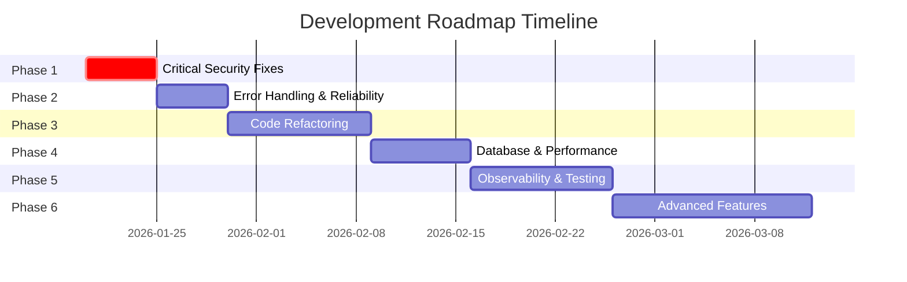

# WhatsApp Gateway Development Roadmap

> **Generated:** January 18, 2026  
> **Based on:** Backend Analysis Report  
> **Approach:** Incremental phases with iterative delivery and testing

---

## Overview

This roadmap divides improvement work into **6 phases**, each building upon the previous. Each phase is designed to be:

- **Independently deliverable** - Can be deployed after completion
- **Testable** - Clear verification criteria
- **Time-boxed** - Estimated duration provided
- **Prioritized** - Critical issues addressed first



---

## Phase 1: Critical Security Hardening

> **Duration:** 1 week  
> **Priority:** 🔴 Critical  
> **Goal:** Eliminate security vulnerabilities that could lead to unauthorized access or data compromise

### 1.1 Fix Authentication Bypass

**File:** `src/middlewares/authMiddleware.ts`

| Task  | Description                                                       | Effort |
| ----- | ----------------------------------------------------------------- | ------ |
| 1.1.1 | Remove auth bypass when `API_KEY` is unset - return 503 instead   | 0.5h   |
| 1.1.2 | Implement timing-safe comparison using `crypto.timingSafeEqual()` | 0.5h   |
| 1.1.3 | Add API key format validation (min length, allowed characters)    | 0.5h   |
| 1.1.4 | Add unit tests for auth middleware                                | 1h     |

**Deliverable:** Auth middleware that fails closed and is resistant to timing attacks

---

### 1.2 Secure Session Storage

**Files:** `src/services/whatsappService.ts`, new `src/config/paths.ts`

| Task  | Description                                                       | Effort |
| ----- | ----------------------------------------------------------------- | ------ |
| 1.2.1 | Create centralized path configuration (`AUTH_DIR` env variable)   | 0.5h   |
| 1.2.2 | Move auth file storage to configurable path outside webroot       | 1h     |
| 1.2.3 | Add `.gitignore` and `.dockerignore` entries for auth directories | 0.25h  |
| 1.2.4 | Add startup validation that auth directory is not under `public/` | 0.5h   |
| 1.2.5 | Document secure deployment configuration                          | 0.5h   |

**Deliverable:** Session credentials stored securely with deployment documentation

---

### 1.3 File Upload Security

**Files:** `src/routes/sessionRoutes.ts`, new `src/config/upload.ts`

| Task  | Description                                                            | Effort |
| ----- | ---------------------------------------------------------------------- | ------ |
| 1.3.1 | Create upload configuration module with file type whitelist            | 1h     |
| 1.3.2 | Add file size limits (configurable via env, default 16MB)              | 0.5h   |
| 1.3.3 | Implement MIME type validation (check magic bytes, not just extension) | 1.5h   |
| 1.3.4 | Use randomized filenames to prevent path traversal                     | 0.5h   |
| 1.3.5 | Configure upload temp directory outside project root                   | 0.5h   |
| 1.3.6 | Add integration tests for file upload validation                       | 1h     |

**Deliverable:** Secure file upload with type/size validation and temp file isolation

---

### 1.4 Webhook URL Validation

**Files:** `src/middlewares/validationMiddleware.ts`, new `src/utils/urlValidator.ts`

| Task  | Description                                               | Effort |
| ----- | --------------------------------------------------------- | ------ |
| 1.4.1 | Create URL validator that blocks private/internal IPs     | 1.5h   |
| 1.4.2 | Block `file://`, `ftp://`, and other non-HTTP(S) schemes  | 0.5h   |
| 1.4.3 | Add configurable allowlist for webhook domains (optional) | 1h     |
| 1.4.4 | Update Joi schema to use custom URL validator             | 0.5h   |
| 1.4.5 | Add unit tests for URL validation edge cases              | 1h     |

**Deliverable:** SSRF-resistant webhook URL validation

---

### 1.5 Graceful Shutdown

**File:** `src/app.ts`, new `src/shutdown.ts`

| Task  | Description                                        | Effort |
| ----- | -------------------------------------------------- | ------ |
| 1.5.1 | Create shutdown handler module                     | 0.5h   |
| 1.5.2 | Implement SIGTERM/SIGINT handlers                  | 0.5h   |
| 1.5.3 | Close all WhatsApp sessions gracefully on shutdown | 1h     |
| 1.5.4 | Close database pool connections                    | 0.25h  |
| 1.5.5 | Close BullMQ worker and wait for active jobs       | 0.5h   |
| 1.5.6 | Add shutdown timeout (force exit after 30s)        | 0.25h  |
| 1.5.7 | Test graceful shutdown in Docker environment       | 1h     |

**Deliverable:** Clean shutdown without orphaned connections or lost messages

---

### Phase 1 Verification Checklist

- [ ] Auth returns 503 when `API_KEY` is not configured
- [ ] Auth uses timing-safe comparison
- [ ] Session files stored outside webroot
- [ ] File uploads reject invalid types/sizes
- [ ] Webhook URLs cannot target internal IPs
- [ ] `docker stop` results in clean shutdown logs
- [ ] All new code has unit tests

---

## Phase 2: Error Handling & Reliability

> **Duration:** 1 week  
> **Priority:** 🟠 High  
> **Goal:** Consistent error handling, better debugging, and improved reliability

### 2.1 Centralized Error Handler

**New files:** `src/middlewares/errorHandler.ts`, `src/errors/AppError.ts`

| Task  | Description                                                            | Effort |
| ----- | ---------------------------------------------------------------------- | ------ |
| 2.1.1 | Create custom `AppError` class with status codes and error codes       | 1h     |
| 2.1.2 | Create specific error types (`ValidationError`, `NotFoundError`, etc.) | 1h     |
| 2.1.3 | Implement Express error handler middleware                             | 1h     |
| 2.1.4 | Add async error wrapper utility (eliminates try-catch in controllers)  | 1h     |
| 2.1.5 | Migrate all controllers to use centralized error handling              | 2h     |
| 2.1.6 | Add error logging with appropriate log levels                          | 0.5h   |

**Deliverable:** Consistent error responses and centralized error logging

---

### 2.2 Request ID Tracking

**New file:** `src/middlewares/requestId.ts`

| Task  | Description                                                               | Effort |
| ----- | ------------------------------------------------------------------------- | ------ |
| 2.2.1 | Create request ID middleware (use `X-Request-ID` header or generate UUID) | 0.5h   |
| 2.2.2 | Attach request ID to Pino logger context                                  | 0.5h   |
| 2.2.3 | Include request ID in all error responses                                 | 0.25h  |
| 2.2.4 | Pass request ID to job queue for tracing                                  | 0.5h   |
| 2.2.5 | Include request ID in webhook payloads                                    | 0.5h   |

**Deliverable:** End-to-end request tracing capability

---

### 2.3 Webhook Reliability

**New files:** `src/queues/webhookQueue.ts`, `src/workers/webhookWorker.ts`

| Task  | Description                                                  | Effort |
| ----- | ------------------------------------------------------------ | ------ |
| 2.3.1 | Create dedicated webhook queue with BullMQ                   | 1h     |
| 2.3.2 | Create webhook worker with retry logic (exponential backoff) | 1.5h   |
| 2.3.3 | Refactor `sendWebhook` to queue instead of fire-and-forget   | 1h     |
| 2.3.4 | Add webhook delivery logging/tracking                        | 1h     |
| 2.3.5 | Implement webhook signing (HMAC signature)                   | 1.5h   |
| 2.3.6 | Add dead letter queue for failed webhooks                    | 1h     |

**Deliverable:** Reliable webhook delivery with retry and audit trail

---

### 2.4 Session Reconnection Improvements

**File:** `src/services/whatsappService.ts`

| Task  | Description                                             | Effort |
| ----- | ------------------------------------------------------- | ------ |
| 2.4.1 | Add configurable max reconnection attempts              | 0.5h   |
| 2.4.2 | Implement exponential backoff for reconnections         | 1h     |
| 2.4.3 | Add circuit breaker pattern for failing sessions        | 1.5h   |
| 2.4.4 | Send webhook on max retries exceeded                    | 0.5h   |
| 2.4.5 | Add session health monitoring (last activity timestamp) | 1h     |

**Deliverable:** Robust reconnection logic with failure notifications

---

### Phase 2 Verification Checklist

- [ ] All API errors return consistent JSON structure
- [ ] All errors are logged with request ID
- [ ] Request ID appears in response headers
- [ ] Webhooks retry on failure (visible in logs)
- [ ] Failed webhooks go to dead letter queue
- [ ] Session reconnection respects backoff
- [ ] Failing sessions don't cause tight retry loops

---

## Phase 3: Code Refactoring & Architecture

> **Duration:** 2 weeks  
> **Priority:** 🟠 High  
> **Goal:** Improve maintainability, testability, and separation of concerns

### 3.1 Break Up WhatsAppService

**New structure:**

```
src/services/
├── session/
│   ├── SessionManager.ts
│   ├── SessionStore.ts
│   └── ConnectionHandler.ts
├── message/
│   ├── MessageSender.ts
│   ├── MediaHandler.ts
│   └── TemplateEngine.ts
└── webhook/
    └── WebhookDispatcher.ts
```

| Task  | Description                                                | Effort |
| ----- | ---------------------------------------------------------- | ------ |
| 3.1.1 | Extract `SessionStore` (in-memory session map management)  | 2h     |
| 3.1.2 | Extract `ConnectionHandler` (Baileys connection lifecycle) | 3h     |
| 3.1.3 | Extract `SessionManager` (orchestrates store + connection) | 2h     |
| 3.1.4 | Extract `MessageSender` (text, media, file sending)        | 2h     |
| 3.1.5 | Extract `MediaHandler` (file reading, type detection)      | 1.5h   |
| 3.1.6 | Extract `TemplateEngine` (template rendering logic)        | 1h     |
| 3.1.7 | Create service interfaces for dependency injection         | 2h     |
| 3.1.8 | Update all imports and ensure existing functionality works | 2h     |
| 3.1.9 | Add unit tests for each extracted service                  | 4h     |

**Deliverable:** Modular, testable service layer

---

### 3.2 TypeScript Improvements

**Files:** Various, new `src/types/` directory

| Task  | Description                                              | Effort |
| ----- | -------------------------------------------------------- | ------ |
| 3.2.1 | Create `src/types/session.types.ts` (session interfaces) | 1h     |
| 3.2.2 | Create `src/types/message.types.ts` (message payloads)   | 1h     |
| 3.2.3 | Create `src/types/webhook.types.ts` (webhook payloads)   | 1h     |
| 3.2.4 | Create `src/types/queue.types.ts` (job data types)       | 1h     |
| 3.2.5 | Add strict types to message worker job handling          | 1h     |
| 3.2.6 | Enable stricter TypeScript compiler options              | 1h     |
| 3.2.7 | Fix all type errors from stricter settings               | 2h     |

**Deliverable:** Fully typed codebase with no `any` types in core logic

---

### 3.3 Repository Pattern for Database Access

**New directory:** `src/repositories/`

| Task  | Description                                            | Effort |
| ----- | ------------------------------------------------------ | ------ |
| 3.3.1 | Create `SessionRepository` (CRUD for sessions table)   | 2h     |
| 3.3.2 | Create `TemplateRepository` (CRUD for templates table) | 1.5h   |
| 3.3.3 | Refactor `templateService.ts` to use repository        | 1h     |
| 3.3.4 | Refactor session-related DB queries to use repository  | 2h     |
| 3.3.5 | Add repository interfaces for testing/mocking          | 1h     |

**Deliverable:** Clean separation between business logic and data access

---

### 3.4 Configuration Centralization

**New file:** `src/config/env.ts`

| Task  | Description                                                     | Effort |
| ----- | --------------------------------------------------------------- | ------ |
| 3.4.1 | Create centralized configuration loader with validation         | 1.5h   |
| 3.4.2 | Use Zod or Joi to validate all environment variables at startup | 1h     |
| 3.4.3 | Fail fast on missing required configuration                     | 0.5h   |
| 3.4.4 | Remove scattered `dotenv.config()` calls                        | 0.5h   |
| 3.4.5 | Add configuration documentation                                 | 0.5h   |

**Deliverable:** Single source of truth for configuration with validation

---

### Phase 3 Verification Checklist

- [ ] `WhatsAppService` is < 200 lines
- [ ] Each new service has corresponding unit tests
- [ ] No `any` types in service/controller code
- [ ] All DB access goes through repositories
- [ ] App fails to start with missing required env vars
- [ ] Existing API functionality unchanged (regression tests pass)

---

## Phase 4: Database & Performance

> **Duration:** 1.5 weeks  
> **Priority:** 🟡 Medium  
> **Goal:** Improve data persistence, query performance, and async operations

### 4.1 Database Migrations

**New directory:** `src/database/migrations/`

| Task  | Description                                              | Effort |
| ----- | -------------------------------------------------------- | ------ |
| 4.1.1 | Install and configure `node-pg-migrate`                  | 1h     |
| 4.1.2 | Create initial migration from existing `init_schema.sql` | 1h     |
| 4.1.3 | Add migration for database indexes                       | 1h     |
| 4.1.4 | Add `updated_at` trigger for auto-update                 | 0.5h   |
| 4.1.5 | Integrate migrations into startup process                | 1h     |
| 4.1.6 | Add migration npm scripts (`migrate:up`, `migrate:down`) | 0.5h   |
| 4.1.7 | Document migration workflow                              | 0.5h   |

**Deliverable:** Version-controlled database schema with rollback capability

---

### 4.2 New Database Tables

| Task  | Description                                   | Effort |
| ----- | --------------------------------------------- | ------ |
| 4.2.1 | Create `message_logs` table migration         | 1h     |
| 4.2.2 | Create `webhook_deliveries` table migration   | 1h     |
| 4.2.3 | Create `session_events` audit table migration | 1h     |
| 4.2.4 | Add appropriate indexes to new tables         | 0.5h   |
| 4.2.5 | Create repositories for new tables            | 2h     |

**Schema for new tables:**

```sql
-- message_logs
CREATE TABLE message_logs (
    id BIGSERIAL PRIMARY KEY,
    session_id VARCHAR(255) NOT NULL,
    direction VARCHAR(10) NOT NULL, -- 'incoming' | 'outgoing'
    message_id VARCHAR(255),
    recipient VARCHAR(255),
    message_type VARCHAR(50),
    content_preview TEXT,
    status VARCHAR(50),
    created_at TIMESTAMP DEFAULT CURRENT_TIMESTAMP,
    FOREIGN KEY (session_id) REFERENCES sessions(session_id)
);

-- webhook_deliveries
CREATE TABLE webhook_deliveries (
    id BIGSERIAL PRIMARY KEY,
    session_id VARCHAR(255) NOT NULL,
    webhook_url TEXT NOT NULL,
    event_type VARCHAR(100) NOT NULL,
    payload JSONB,
    status VARCHAR(50), -- 'pending' | 'delivered' | 'failed'
    attempts INT DEFAULT 0,
    last_attempt_at TIMESTAMP,
    created_at TIMESTAMP DEFAULT CURRENT_TIMESTAMP
);

-- session_events
CREATE TABLE session_events (
    id BIGSERIAL PRIMARY KEY,
    session_id VARCHAR(255) NOT NULL,
    event_type VARCHAR(100) NOT NULL,
    details JSONB,
    created_at TIMESTAMP DEFAULT CURRENT_TIMESTAMP
);
```

**Deliverable:** Rich data model for analytics and debugging

---

### 4.3 Persistent Message Logging

**Files:** `src/services/session/SessionManager.ts`, new `MessageLogRepository.ts`

| Task  | Description                                              | Effort |
| ----- | -------------------------------------------------------- | ------ |
| 4.3.1 | Create `MessageLogRepository`                            | 1h     |
| 4.3.2 | Replace in-memory message log with database persistence  | 1.5h   |
| 4.3.3 | Add log rotation/cleanup (delete logs older than X days) | 1h     |
| 4.3.4 | Update `getMessageLog` endpoint to query database        | 1h     |
| 4.3.5 | Add pagination to message log endpoint                   | 1h     |

**Deliverable:** Persistent, queryable message history

---

### 4.4 Async File Operations

**File:** `src/services/message/MediaHandler.ts`

| Task  | Description                                           | Effort |
| ----- | ----------------------------------------------------- | ------ |
| 4.4.1 | Replace `fs.readFileSync` with `fs.promises.readFile` | 0.5h   |
| 4.4.2 | Replace `fs.existsSync` with `fs.promises.access`     | 0.5h   |
| 4.4.3 | Use streams for large file handling                   | 1.5h   |
| 4.4.4 | Add file read timeout to prevent hanging              | 0.5h   |

**Deliverable:** Non-blocking file operations

---

### 4.5 Database Pool Configuration

**File:** `src/config/database.ts`

| Task  | Description                                                  | Effort |
| ----- | ------------------------------------------------------------ | ------ |
| 4.5.1 | Add pool configuration (max, idleTimeout, connectionTimeout) | 0.5h   |
| 4.5.2 | Add pool error event handlers                                | 0.5h   |
| 4.5.3 | Add connection health check utility                          | 0.5h   |
| 4.5.4 | Make pool settings configurable via environment              | 0.5h   |

**Deliverable:** Optimized database connection pool

---

### 4.6 Parallel Session Restoration

**File:** `src/services/session/SessionManager.ts`

| Task  | Description                                            | Effort |
| ----- | ------------------------------------------------------ | ------ |
| 4.6.1 | Install `p-limit` for concurrency control              | 0.25h  |
| 4.6.2 | Refactor `restoreSessions` to use parallel restoration | 1h     |
| 4.6.3 | Add configurable concurrency limit                     | 0.5h   |
| 4.6.4 | Add progress logging during restoration                | 0.5h   |
| 4.6.5 | Handle partial restoration failures gracefully         | 1h     |

**Deliverable:** Fast startup even with many sessions

---

### Phase 4 Verification Checklist

- [ ] `npm run migrate:up` applies pending migrations
- [ ] `npm run migrate:down` rolls back last migration
- [ ] Message logs persist across server restarts
- [ ] Message log endpoint supports pagination
- [ ] No synchronous file system calls in hot paths
- [ ] 50+ sessions restore in < 30 seconds

---

## Phase 5: Observability & Testing

> **Duration:** 2 weeks  
> **Priority:** 🟡 Medium  
> **Goal:** Production visibility, confidence in changes, and comprehensive documentation

### 5.1 Health Check Improvements

**File:** `src/routes/health.ts`

| Task  | Description                                                  | Effort |
| ----- | ------------------------------------------------------------ | ------ |
| 5.1.1 | Create dedicated health check router                         | 0.5h   |
| 5.1.2 | Add database connectivity check                              | 0.5h   |
| 5.1.3 | Add Redis connectivity check                                 | 0.5h   |
| 5.1.4 | Add BullMQ queue health check                                | 0.5h   |
| 5.1.5 | Add session summary stats (connected/disconnected counts)    | 1h     |
| 5.1.6 | Add `/health/ready` (full checks) and `/health/live` (basic) | 0.5h   |
| 5.1.7 | Add system info (uptime, memory, version)                    | 0.5h   |

**Deliverable:** Comprehensive health endpoints for monitoring

---

### 5.2 Structured Logging Improvements

**File:** `src/utils/logger.ts`

| Task  | Description                                                       | Effort |
| ----- | ----------------------------------------------------------------- | ------ |
| 5.2.1 | Create centralized logger configuration                           | 1h     |
| 5.2.2 | Add log field redaction for sensitive data                        | 1h     |
| 5.2.3 | Add log context (session ID, request ID)                          | 1h     |
| 5.2.4 | Configure log output format (JSON for production, pretty for dev) | 0.5h   |
| 5.2.5 | Add log sampling for high-volume events                           | 1h     |

**Deliverable:** Production-ready logging with PII protection

---

### 5.3 Metrics (Prometheus)

**New files:** `src/metrics/`, `src/routes/metrics.ts`

| Task  | Description                                            | Effort |
| ----- | ------------------------------------------------------ | ------ |
| 5.3.1 | Install `prom-client`                                  | 0.25h  |
| 5.3.2 | Create metrics registry and default metrics            | 0.5h   |
| 5.3.3 | Add HTTP request metrics (duration, status codes)      | 1h     |
| 5.3.4 | Add session metrics (active, by status)                | 1h     |
| 5.3.5 | Add message queue metrics (pending, processed, failed) | 1h     |
| 5.3.6 | Add `/metrics` endpoint                                | 0.5h   |
| 5.3.7 | Create Grafana dashboard JSON (template)               | 2h     |

**Deliverable:** Prometheus metrics endpoint with key business metrics

---

### 5.4 Testing Infrastructure

| Task  | Description                                          | Effort |
| ----- | ---------------------------------------------------- | ------ |
| 5.4.1 | Install testing dependencies (Vitest, supertest)     | 0.5h   |
| 5.4.2 | Configure test environment                           | 1h     |
| 5.4.3 | Create test utilities (mock factories, DB helpers)   | 2h     |
| 5.4.4 | Write unit tests for services (80%+ coverage target) | 8h     |
| 5.4.5 | Write integration tests for API endpoints            | 6h     |
| 5.4.6 | Add test database setup/teardown scripts             | 1h     |
| 5.4.7 | Configure CI test pipeline                           | 2h     |

**Deliverable:** Automated test suite with CI integration

---

### 5.5 API Documentation (OpenAPI)

**New files:** `src/docs/openapi.yaml`, `src/routes/docs.ts`

| Task  | Description                                    | Effort |
| ----- | ---------------------------------------------- | ------ |
| 5.5.1 | Create OpenAPI 3.0 spec for existing endpoints | 4h     |
| 5.5.2 | Add example requests/responses                 | 2h     |
| 5.5.3 | Integrate Swagger UI at `/docs`                | 1h     |
| 5.5.4 | Add OpenAPI validation middleware (optional)   | 2h     |

**Deliverable:** Interactive API documentation

---

### Phase 5 Verification Checklist

- [ ] `/health/ready` returns 503 on any dependency failure
- [ ] `/metrics` returns Prometheus-formatted metrics
- [ ] `npm test` runs and passes
- [ ] Test coverage > 80%
- [ ] `/docs` serves Swagger UI
- [ ] Logs contain no raw passwords/tokens

---

## Phase 6: Advanced Features

> **Duration:** 2-3 weeks  
> **Priority:** 🟢 Enhancement  
> **Goal:** Add value-added features from the roadmap

### 6.1 Message Status Tracking

| Task  | Description                                                  | Effort |
| ----- | ------------------------------------------------------------ | ------ |
| 6.1.1 | Listen for `messages.update` event in Baileys                | 1h     |
| 6.1.2 | Track message status (sent → delivered → read) in database   | 2h     |
| 6.1.3 | Add `message_status_update` webhook event                    | 1h     |
| 6.1.4 | Create endpoint `GET /sessions/{id}/messages/{msgId}/status` | 1.5h   |
| 6.1.5 | Add retry logic for undelivered messages                     | 2h     |

**Deliverable:** Full message lifecycle visibility

---

### 6.2 Scheduled Messages

| Task  | Description                                            | Effort |
| ----- | ------------------------------------------------------ | ------ |
| 6.2.1 | Add `scheduled_at` field to message queue jobs         | 0.5h   |
| 6.2.2 | Create `POST /sessions/{id}/message/schedule` endpoint | 1.5h   |
| 6.2.3 | Use BullMQ delayed jobs for scheduling                 | 1h     |
| 6.2.4 | Add endpoint to list/cancel scheduled messages         | 2h     |
| 6.2.5 | Add timezone handling                                  | 1h     |

**Deliverable:** Message scheduling capability

---

### 6.3 Message Batching

| Task  | Description                                         | Effort |
| ----- | --------------------------------------------------- | ------ |
| 6.3.1 | Create `POST /sessions/{id}/message/batch` endpoint | 2h     |
| 6.3.2 | Add batch validation (max 100 messages per batch)   | 1h     |
| 6.3.3 | Queue messages with batch ID for tracking           | 1h     |
| 6.3.4 | Create batch status endpoint                        | 1.5h   |
| 6.3.5 | Add rate limiting within batch processing           | 1h     |

**Deliverable:** Bulk message sending with tracking

---

### 6.4 Group Management

| Task  | Description                                     | Effort |
| ----- | ----------------------------------------------- | ------ |
| 6.4.1 | Add endpoint to list groups for a session       | 2h     |
| 6.4.2 | Add endpoint to get group metadata              | 1.5h   |
| 6.4.3 | Add support for sending messages to groups      | 1h     |
| 6.4.4 | Add group creation endpoint                     | 2h     |
| 6.4.5 | Add participant management (add/remove/promote) | 3h     |
| 6.4.6 | Handle group message webhooks                   | 1.5h   |

**Deliverable:** Full group chat support

---

### 6.5 Contact Management

| Task  | Description                                    | Effort |
| ----- | ---------------------------------------------- | ------ |
| 6.5.1 | Add endpoint to check if number is on WhatsApp | 1.5h   |
| 6.5.2 | Add endpoint to get contact profile info       | 1.5h   |
| 6.5.3 | Add block/unblock functionality                | 1.5h   |
| 6.5.4 | Cache contact data for performance             | 2h     |

**Deliverable:** Contact verification and management

---

### 6.6 Reply & Quote Messages

| Task  | Description                                      | Effort |
| ----- | ------------------------------------------------ | ------ |
| 6.6.1 | Add `replyTo` field in message send endpoints    | 1h     |
| 6.6.2 | Implement Baileys quote message functionality    | 1.5h   |
| 6.6.3 | Include quoted message info in incoming webhooks | 1h     |

**Deliverable:** Message threading support

---

### Phase 6 Verification Checklist

- [ ] Message status webhooks fire for delivered/read
- [ ] Scheduled messages send at correct time
- [ ] Batch endpoint handles 100 messages successfully
- [ ] Groups can be listed and messaged
- [ ] Contact check returns valid WhatsApp status
- [ ] Replies show as quoted in WhatsApp

---

## Appendix: Estimated Timeline Summary

| Phase   | Focus                        | Duration  | Cumulative |
| ------- | ---------------------------- | --------- | ---------- |
| Phase 1 | Critical Security            | 1 week    | Week 1     |
| Phase 2 | Error Handling & Reliability | 1 week    | Week 2     |
| Phase 3 | Code Refactoring             | 2 weeks   | Week 4     |
| Phase 4 | Database & Performance       | 1.5 weeks | Week 5-6   |
| Phase 5 | Observability & Testing      | 2 weeks   | Week 7-8   |
| Phase 6 | Advanced Features            | 2-3 weeks | Week 10-11 |

**Total estimated time: 10-12 weeks** (with buffer for unforeseen issues)

---

## Appendix: Quick Wins (Can Be Done Anytime)

These small improvements can be tackled opportunistically:

- [ ] Add `prettier` and `eslint` configuration
- [ ] Add `husky` pre-commit hooks
- [ ] Improve README with badge and quick start
- [ ] Add `CONTRIBUTING.md`
- [ ] Create Docker multi-stage build for smaller images
- [ ] Add `npm run lint:fix` script
- [ ] Update dependencies to latest stable versions

---

## Success Criteria

The roadmap is complete when:

1. ✅ Zero critical security vulnerabilities
2. ✅ All services have unit test coverage > 80%
3. ✅ API errors return consistent JSON with request IDs
4. ✅ Database uses migration-based schema management
5. ✅ Health endpoints verify all dependencies
6. ✅ Metrics available for monitoring
7. ✅ Interactive API documentation available
8. ✅ Message status tracking functional
9. ✅ At least one advanced feature (scheduling OR batching OR groups) implemented
